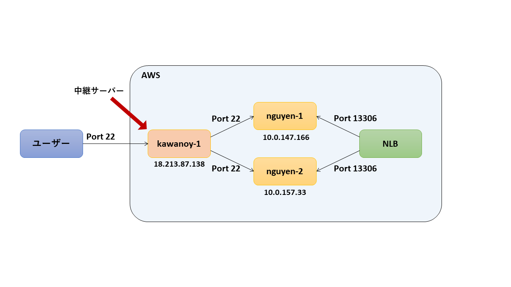
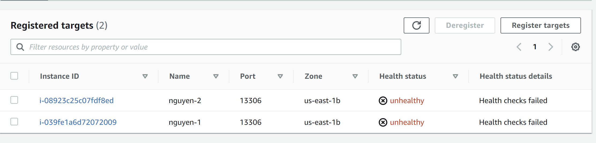
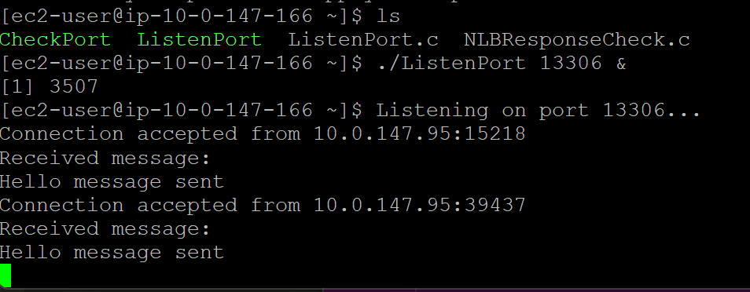
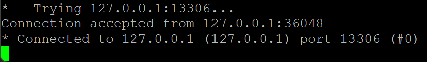

# 検証環境で実際にNLBとEC2つかってhealth check 応答プログラム

## **実行方法**
ListenPort.cでは、各Instanceのlocalhostで自分自身のポート13306の応答を確認するC言語のプログラムです。そのため、AWSサーバ環境でgccをインストールすることは必要です。

例えば、13306ポートを確認したい場合、以下のコードを入力します。

```
gcc -o ListenPort ListenPort.c
./ListenPort 13306
```

成功したら以下の図に表しています。

<div style="text-align: center;">
</div>

ListenPort.cは応答したまま無限ループプログラムなので、Hello message sent to the clientを何回繰り返して応答します。

<div style="text-align: center;">
</div>

現在、AWS検証環境で NLBで登録したnguyen-1 と nguyen-2 のHealth Check に応答しなかったので、 Unhealthy 状態になっています。ポートの応答を以下に実施します。

<div style="text-align: center;">
</div>

ListenPort をバックグラウンド実行して local の curl でconnect を確認します。
   
例えば、local は nguyen-1 とします。ここで ListenPort.c のプログラムを導入して、以下のように実施します。
```
./ListenPort 13306 &
```
以下のメッセージが出てきます。
<div style="text-align: center;">
</div>

ListenPortを無限ループで実行したままで、
```
curl -m 5 -v telnet://127.0.0.1:13306
```
を入力して、ポート13306で ```127.0.0.1:13306``` にConnectedメッセージが表示されます。
<div style="text-align: center;">
</div>

nguyen-1 の例と同様にlocal は nguyen-2 として、同じ手順で行います。kawanoy-1からも以上の手順で行えます。この段階は省略します。

Target Groupをクリックして NLB を選択すると、登録した Target で 各Instance を確認できます。以上の手順で行って nguyen-1 と nguyen-2 の状態は Healthy になっています。

上記確認に必要なSecurityGroup のルールは **[こちら](https://github.com/metamoji/tr-nguyen-mysql/blob/main/HeathCheckProgram/%E8%AA%AC%E6%98%8E.md)** で設定します。

## **その他**
NLBResponseCheck.cは、ポートが空いているかを確認するプログラムです。念のため、作成しました。

```
gcc -o CheckPort NLBResponseCheck.c
./CheckPort 10.0.157.33 22
```

以上の例は10.0.157.33のIPアドレスは22ポートに通っています。

<div style="text-align: center;">
</div>

また、10.0.147.166のIPアドレスは22ポートにも通っています。