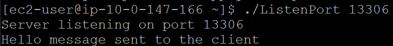
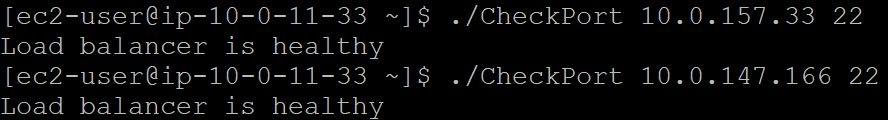

# NLB の health check の概要設計

## **実行方法**
ListenPort.cでは、各Instanceのlocalhostで自分自身のポート13306の応答を確認するC言語のプログラムです。そのため、AWSサーバ環境でgccをインストールすることは必要です。

例えば、13306ポートを確認したい場合、以下のコードを入力します。

```
gcc -o ListenPort ListenPort.c
./ListenPort 13306
```

成功したら以下の図に表しています。

<div style="text-align: center;">
</div>

ListenPort.cは応答したまま無限ループプログラムなので、Hello message sent to the clientを何回繰り返して応答します。

## **その他**
NLBResponseCheck.cは、ポートが空いているかを確認するプログラムです。念のため、作成しました。

```
gcc -o CheckPort NLBResponseCheck.c
./CheckPort 10.0.157.33 22
```

以上の例は10.0.157.33のIPアドレスは22ポートに通っています。

<div style="text-align: center;">
</div>

また、10.0.147.166のIPアドレスは22ポートにも通っています。