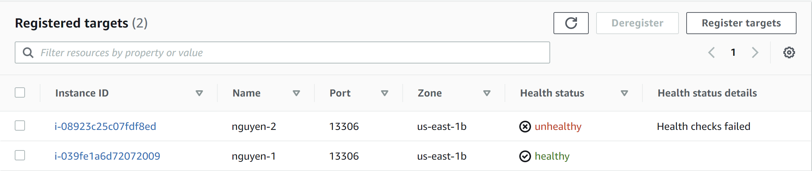
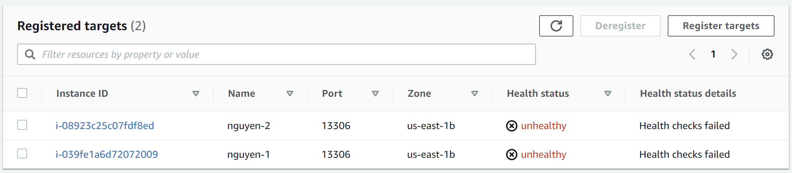

# local MariaDB serverの稼働状況によってhealthy/unhealthyを切り替える

## **実行方法**
**[検証環境で実際にNLBとEC2つかってhealth check 応答プログラム](https://github.com/metamoji/tr-nguyen-mysql/blob/main/HeathCheckProgram/%E8%AA%AC%E6%98%8E.md)** でNLBがHealthy/ Unhealthy の状態であるか確認できました。今回 Health Checker で、local MariaDB Server が止まっていたら、NLB target groupからみて Unhealthy にして、local MariaDB Server が開始したら、Healthyにします。

例えば nguyen-1 の Local で MariaDB Server を開始します。
```
sudo systemctl start mariadb
```

そして、**[こちら](https://github.com/metamoji/tr-nguyen-mysql/blob/main/HeathCheckProgram/%E8%AA%AC%E6%98%8E.md)** と同じように ListenPortMariaDB.c を実行するとします。
```
./ListenPortMariaDB 13306 &
```
以下のメッセージが出てきます。
```
[ec2-user@ip-10-0-147-166 ~]$ Listening on port 13306...
MariaDB server is running locally
Connection accepted from 10.0.147.95:44906
Received message:
Hello message sent
```

応答したまま無限ループプログラムなので、Hello message sent を何回繰り返して応答します。ListenPortMariaDB を無限ループで実行したままで、
```
curl -m 5 -v telnet://127.0.0.1:13306
```
を入力して、ポート13306で ```127.0.0.1:13306``` にConnectedメッセージが表示されます。
```
*   Trying 127.0.0.1:13306...
Connection accepted from 127.0.0.1:59432
* Connected to 127.0.0.1 (127.0.0.1) port 13306 (#0)
```

nguyen-1 に NLB がHealthyになっています。
<div style="text-align: center;">
</div>

nguyen-1 の Local で MariaDB Server を停止するとします。以下にコマンド
```
sudo systemctl stop mariadb
```
を入力すると、応答したまま無限ループプログラムが止まって、Unhealthy の状態になります。

<div style="text-align: center;">
</div>


nguyen-1 の例と同様にlocal は nguyen-2 として、同じ手順で行います。MariaDB Server を開始したら、Healthy の状態になり、MariaDB Server が止まったら、Unhealthy の状態になります。この段階は省略します。

Target Groupをクリックして NLB を選択すると、登録した Target で 各Instance を確認できます。