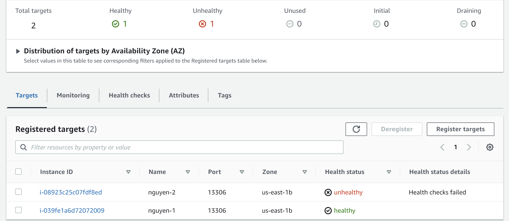

# Health Checker の Service化

商用サービスの運用で使うhealth checker には下記の要件もあります。
* なにかの原因でprocessがkillされてもすぐに再起動して health checkの機能を停めません。
* Instance の restart や reboot が上記の原因でも、自動起動しなければなりません。

ListenPortMariaDB.c をサービス化するには、以下の手順に従うことができます。
1. ListenPortMariaDB.c をコンパイルして実行可能ファイルを作成します。
    ```
    gcc -o healthchecker ListenPortMariaDB.c
    ```
    **※** healthchecker は ```/opt/metamoji/bin/``` までコピーします
    。
    ```
    sudo cp ./healthchecker /opt/metamoji/bin/.
    ```

2. ```/etc/systemd/system/``` ディレクトリに healthchecker.service という名前の新しいサービスファイルを作成します。**[サービスファイル](./healthchecker.service)** の内容は以下のようになります。
    ```
    [Unit]
    Description=healthchecker
    After=mariadb.service network.target

    [Service]
    Type=simple
    ExecStart=/opt/metamoji/bin/healthchecker 13306
    Restart=always

    [Install]
    WantedBy=multi-user.target
    ```

* After=mariadb.service network.target は、healthchecker が実行される前に、MariaDB とネットワークが起動していることを保証します。

* Type=simple は、healthchecker がバックグラウンドで実行される簡単なサービスであることを指定します。

* ExecStart=/opt/metamoji/bin/healthchecker 13306 は、ポート 13306 で healthchecker を実行するコマンドを指定します。

* Restart=always は、healthchecker が processが killされても自動的に再起動するように設定します。

3. サービスファイルを再読み込みして、mariadbと healthchecker を自動起動するように設定します。

    ```
    sudo systemctl daemon-reload
    sudo systemctl enable mariadb healthchecker
    ```

    ```sudo systemctl status mariadb healthchecker``` を入力すると、mariadb と healthchecker を起動していないとき、以下のメッセージが出ます。
    ```
    [ec2-user@ip-10-0-147-166 ~]$ sudo systemctl status mariadb healthchecker
    ● mariadb.service - MariaDB 10.5 database server
    Loaded: loaded (/usr/lib/systemd/system/mariadb.service; enabled; vendor preset: disabled)
    Active: inactive (dead) since Thu 2023-03-09 07:08:44 UTC; 25s ago
        Docs: man:mariadbd(8)
            https://mariadb.com/kb/en/library/systemd/
    Process: 4474 ExecStart=/usr/libexec/mariadbd --basedir=/usr $MYSQLD_OPTS $_WSREP_NEW_CLUSTER (code=exited, status=0/SUCCESS)
    Main PID: 4474 (code=exited, status=0/SUCCESS)
    Status: "MariaDB server is down"

    Mar 09 06:37:44 ip-10-0-147-166.ec2.internal systemd[1]: Starting MariaDB 10.5 database server...
    Mar 09 06:37:44 ip-10-0-147-166.ec2.internal mariadb-prepare-db-dir[4435]: Database MariaDB is probably initialized in /var/lib/mysql already, nothing is done.
    Mar 09 06:37:44 ip-10-0-147-166.ec2.internal mariadbd[4474]: 2023-03-09  6:37:44 0 [Note] /usr/libexec/mariadbd (mysqld 10.5.10-MariaDB) starting as process 4474 ...
    Mar 09 06:37:44 ip-10-0-147-166.ec2.internal systemd[1]: Started MariaDB 10.5 database server.
    Mar 09 07:08:44 ip-10-0-147-166.ec2.internal systemd[1]: Stopping MariaDB 10.5 database server...
    Mar 09 07:08:44 ip-10-0-147-166.ec2.internal systemd[1]: Stopped MariaDB 10.5 database server.

    ● healthchecker.service - healthchecker
    Loaded: loaded (/etc/systemd/system/healthchecker.service; enabled; vendor preset: disabled)
    Active: inactive (dead) since Thu 2023-03-09 07:08:44 UTC; 26s ago
    Main PID: 4558 (code=killed, signal=TERM)

    Mar 09 06:37:44 ip-10-0-147-166.ec2.internal systemd[1]: Started healthchecker.
    Mar 09 07:01:39 ip-10-0-147-166.ec2.internal systemd[1]: Current command vanished from the unit file, execution of the command list won't be resumed.
    Mar 09 07:08:44 ip-10-0-147-166.ec2.internal systemd[1]: Stopping healthchecker...
    Mar 09 07:08:44 ip-10-0-147-166.ec2.internal systemd[1]: Stopped healthchecker.
    ```

    このため、mariadbと healthchecker を自動起動するように設定します。
    ```
    sudo systemctl start mariadb healthchecker
    ```

これで、healthchecker は自動的に起動し、ProcessがKillされても自動的に再起動されます。また、MariaDBが起動するたびに healthchecker も起動するように設定されます。

nguyen-1 で healthcheckerを service化したので、nguyen-1 の Instanceを再起動しても Target Groupで nguyen-1 は Healthyの状態です。
<div style="text-align: center;">
</div>