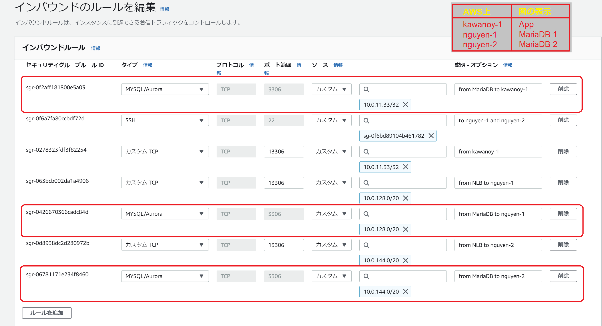

# MariaDBのNLB分散構成をつくる
**[以前のHealth Check をサービス化しました](https://github.com/metamoji/tr-nguyen-mysql/blob/main/SwitchHealthServiceFile/Service%E5%8C%96%E3%81%AE%E8%AA%AC%E6%98%8E%E6%9B%B8.md)**。MariaDB の NLB 分散の構成を作成します。

Load Balancer の Health Check が効けば、MariaDB 障害を自動検知して切り離しもできます。しかし、同じ 13306 ポートで通ると、**[NLB の Health Check が MariaDB が接続ホストをブロックしてしまいます](https://qiita.com/araryo/items/09eb79c59be7e3961bc0)**。このため、MariaDB のポートを Health Check 以外のポートに変更しなければなりません。具体的には、MariaDB のポートは 3306 に設けます。

<div style="text-align: center;">
</div>

まず、Target Groupで 3306 ポートを作成します。MariaDB の Target Group を選択して Health checks タブで編集します。

<div style="text-align: center;">
</div>

そして、Health Check の設定では、通常はサービスの 13306 ポートを使用して行われます。しかし、新しいポート（例えば 3306 ポート）を開いた場合、3306 ポートは MariaDB で実施し、13306 ポートで Health Check を実行するように指示する必要があります。それが、新しいポートの「オーバーライド」設定を行う理由です。以下と同様に設定をします。

<div style="text-align: center;">
</div>

```intern-nlb-sg``` で 13306 ポートは、現在、```0.0.0.0/0``` で設定しています。つまり、すべてのIPアドレスに接続します。今回、すべてのIPアドレスを接続するだけではなく、具体的な IP アドレスに絞ってみます。inbound の 13306 の source は NLB ですが、NLB にはsecurity group がつかないのでその指定はできません。それなら subnet で指定したいですが、subnet-id は source に指定できません。対策として、subnet の CIDR で指定する ```10.0.128.0/20``` と ```10.0.144.0/20```です。

Network Mapping は、EC2のプライベートIPアドレスを指定するために使用されます。これにより、Load Balancer がトラフィックを受け取った後、EC2インスタンスにリクエストを送信するための正しい宛先を特定することができます。また、Private IPv4 addressは、セキュリティ上の理由から、EC2インスタンスのプライベートIPアドレスを公開しなくて済むようにするためにも使用されます。

AWSの NLB がIP パケットを転送するときに、IPパケットをそのまま中継するために使用されます。つまり、NLBはネットワークトラフィックを単純に通して、処理の遅延を最小限にすることができます。NLBは土管なので、元のIPは伝えていますが、```security group-id```が動かなくなります。このため、```kawanoy-1``` から 3306ポートを開けて、```10.0.11.33/32```を追加しました。この結果、疎通しました。
```
[ec2-user@ip-10-0-11-33 ~]$ curl -v telnet://10.0.147.166:13306
*   Trying 10.0.147.166:13306...
* Connected to 10.0.147.166 (10.0.147.166) port 13306 (#0)
```

```
[ec2-user@ip-10-0-11-33 ~]$ curl -v telnet://10.0.157.33:13306
*   Trying 10.0.157.33:13306...
* Connected to 10.0.157.33 (10.0.157.33) port 13306 (#0)
```

NLB の「今の」private IP は
```
[ec2-user@ip-10-0-11-33 ~]$ nslookup NLB-c7f279df213468c3.elb.us-east-1.amazonaws.com
Server:         10.0.0.2
Address:        10.0.0.2#53

Non-authoritative answer:
Name:   NLB-c7f279df213468c3.elb.us-east-1.amazonaws.com
Address: 10.0.134.229
Name:   NLB-c7f279df213468c3.elb.us-east-1.amazonaws.com
Address: 10.0.147.95
```

しかし、これは Amazon 側の都合で長期的には変わってしまう可能性があります。例えば、AutoScale やメンテナンスや機器故障などです。このため、 subnet の CIDR で範囲を手広く source に指定します。

3306 ポートも上と同様に設定します。```intern-nlb-sg```のインバウンドで以下の図と同様に設定します。

<div style="text-align: center;">
</div>

```
[ec2-user@ip-10-0-11-33 ~]$ curl -v telnet://10.0.147.166:3306
*   Trying 10.0.147.166:3306...
* Connected to 10.0.147.166 (10.0.147.166) port 3306 (#0)
```

```
[ec2-user@ip-10-0-11-33 ~]$ curl -v telnet://10.0.157.33:3306
*   Trying 10.0.157.33:3306...
* Connected to 10.0.157.33 (10.0.157.33) port 3306 (#0)
```

```
[ec2-user@ip-10-0-11-33 ~]$ curl -v telnet://NLB-c7f279df213468c3.elb.us-east-1.amazonaws.com:3306
*   Trying 10.0.147.95:3306...
* Connected to NLB-c7f279df213468c3.elb.us-east-1.amazonaws.com (10.0.147.95) port 3306 (#0)
```

MySQL で DB をアクセスしてみます。
```
[ec2-user@ip-10-0-11-33 ~]$ mysql -u metamoji -p -h NLB-c7f279df213468c3.elb.us-east-1.amazonaws.com -P 3306
Enter password:
Welcome to the MySQL monitor.  Commands end with ; or \g.
Your MySQL connection id is 1212
Server version: 5.5.5-10.5.18-MariaDB MariaDB Server

Copyright (c) 2000, 2023, Oracle and/or its affiliates.

Oracle is a registered trademark of Oracle Corporation and/or its
affiliates. Other names may be trademarks of their respective
owners.

Type 'help;' or '\h' for help. Type '\c' to clear the current input statement.

mysql>
```

ユーザーと PW は **[こちら](./MariaDB%E3%81%ABgrant%E6%96%87%E3%81%AE%E8%AA%BF%E6%95%B4.md)** に参考します。

アクセス成功になりました。

## **[AWS 資料](https://docs.aws.amazon.com/ja_jp/elasticloadbalancing/latest/network/introduction.html)**