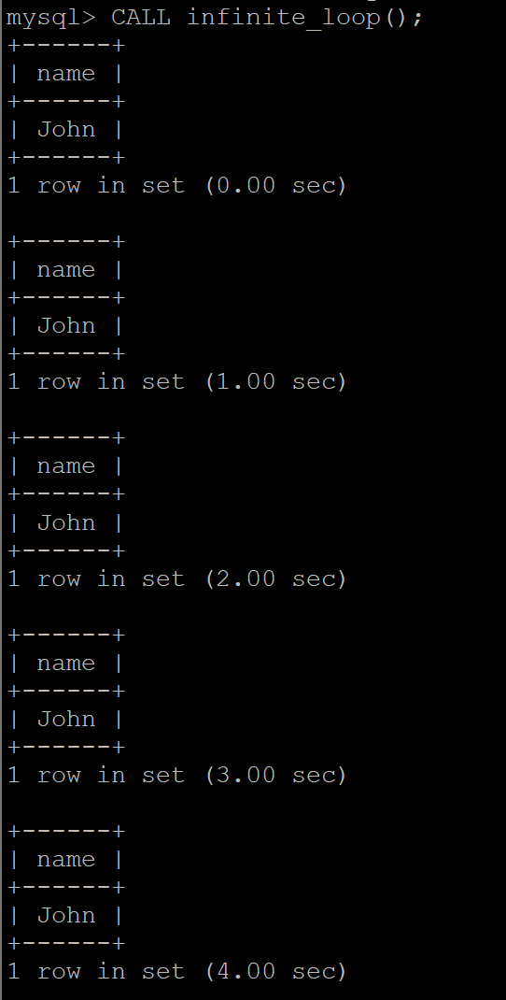
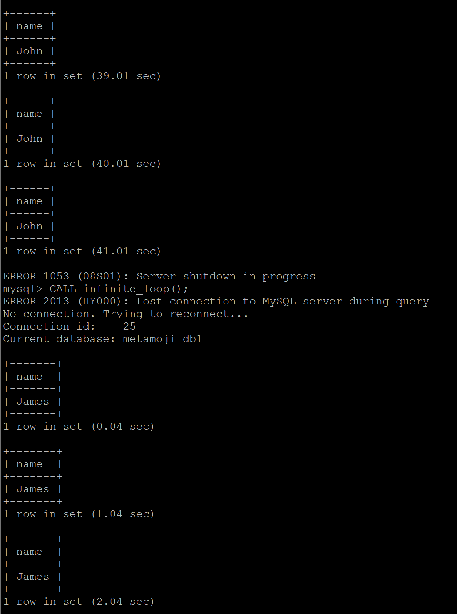
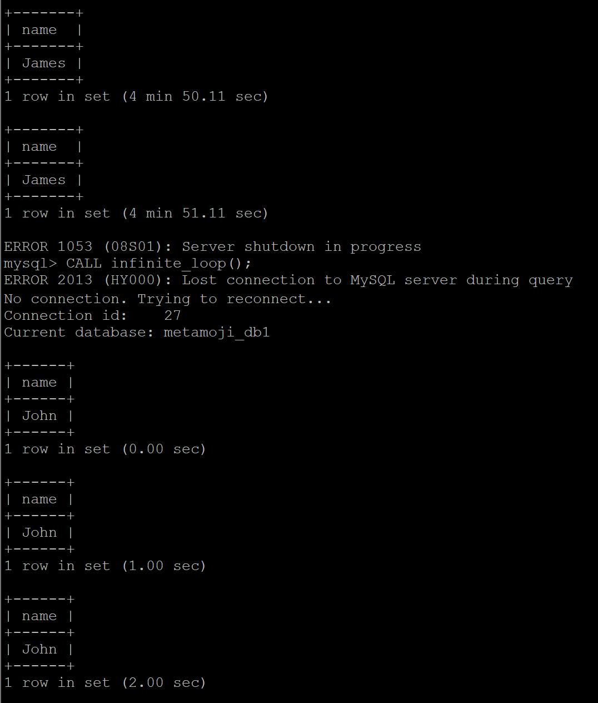

# NLB - Health Checker - MariaDB の結合テスト

* NLB の target group に ```nguyen-1``` , ```nguyen-2```
* ```kawanoy-1``` に mysql client をインストール

```nguyen-1```の MySQL で```metamoji_db1``` のテーブルを作成します。
```
MariaDB [(none)]> create database metamoji_db1;
Query OK, 1 row affected (0.000 sec)

MariaDB [(none)]> show databases;
+--------------------+
| Database           |
+--------------------+
| information_schema |
| metamoji_db1       |
| mysql              |
| performance_schema |
+--------------------+
4 rows in set (0.000 sec)
```

```nguyen-2```の MySQL で```metamoji_db2``` のテーブルを作成します。
```
MariaDB [(none)]> create database metamoji_db2;
Query OK, 1 row affected (0.000 sec)

MariaDB [(none)]> show databases;
+--------------------+
| Database           |
+--------------------+
| information_schema |
| metamoji_db2       |
| mysql              |
| performance_schema |
+--------------------+
4 rows in set (0.000 sec)
```


## **1. ```kawanoy-1``` から NLB 経由で、MariaDB に接続し SQL を実行し、切断**


```
[ec2-user@ip-10-0-11-33 ~]$ curl -v telnet://NLB-c7f279df213468c3.elb.us-east-1.amazonaws.com:3306
*   Trying 10.0.147.95:3306...
* Connected to NLB-c7f279df213468c3.elb.us-east-1.amazonaws.com (10.0.147.95) port 3306 (#0)
```

```
[ec2-user@ip-10-0-11-33 ~]$ mysql -u metamoji -p -h NLB-c7f279df213468c3.elb.us-east-1.amazonaws.com -P 3306
Enter password:
Welcome to the MySQL monitor.  Commands end with ; or \g.
Your MySQL connection id is 1212
Server version: 5.5.5-10.5.18-MariaDB MariaDB Server

Copyright (c) 2000, 2023, Oracle and/or its affiliates.

Oracle is a registered trademark of Oracle Corporation and/or its
affiliates. Other names may be trademarks of their respective
owners.

Type 'help;' or '\h' for help. Type '\c' to clear the current input statement.

mysql>
```
```
mysql> show databases;
+--------------------+
| Database           |
+--------------------+
| information_schema |
| metamoji_db1       |
| mysql              |
| performance_schema |
+--------------------+
4 rows in set (0.00 sec)

mysql>
```
```metamoji_db1``` が存在するので、```nguyen-1``` の DB にアクセスできました。Instance ```nguyen-1``` を Stop して、DB にアクセスすると、
```
mysql> show databases;
+--------------------+
| Database           |
+--------------------+
| information_schema |
| metamoji_db2       |
| mysql              |
| performance_schema |
+--------------------+
4 rows in set (0.00 sec)

mysql>
```
```metamoji_db2``` が存在するので、```nguyen-2``` の DB にアクセスできました。つまり、Instance ```nguyen-1``` を切る際に、```nguyen-2```にアクセスします。逆に、```nguyen-2``` を切る際に、```nguyen-1```にアクセスします。

## **2. 繰り返して、nguyen-1, 'nguyen-2' で負荷分散するか**

以下のコマンドを入力し、DB にアクセスします。
```
[ec2-user@ip-10-0-11-33 ~]$ mysql -u metamoji -p -h NLB-c7f279df213468c3.elb.us-east-1.amazonaws.com -P 3306
```

```nguyen-1``` から MariaDB にアクセスする場合
```
mysql> show databases;
+--------------------+
| Database           |
+--------------------+
| information_schema |
| metamoji_db2       |
| mysql              |
| performance_schema |
+--------------------+
4 rows in set (0.00 sec)

mysql>
```

```nguyen-2``` から MariaDB にアクセスする場合
```
mysql> show databases;
+--------------------+
| Database           |
+--------------------+
| information_schema |
| metamoji_db1       |
| mysql              |
| performance_schema |
+--------------------+
4 rows in set (0.00 sec)

mysql>
```

## **3. ```kawanoy-1``` から NLB経由で、MariaDB に接続し SQL を実行、切断せずに SQL 実行を繰り返す**

テーブルのデータを統一するために、```nguyen-2``` のテーブルに ```metamoji_db1``` を追加します。```nguyen-2``` から MariaDB にアクセスする場合
```
mysql> show databases;
+--------------------+
| Database           |
+--------------------+
| information_schema |
| metamoji_db1       |
| metamoji_db2       |
| mysql              |
| performance_schema |
+--------------------+
5 rows in set (0.00 sec)

mysql>
```

```nguyen-1``` と ```nguyen-2``` は両方とも、以下に手順でデータを挿入します。
1. ```metamoji_db1``` データベースに接続します。
    ```
    USE metamoji_db1;
    ```

2. ```metamoji_test``` テーブルを作成します。
    ```
    CREATE TABLE metamoji_test (id INT NOT NULL PRIMARY KEY, name VARCHAR(20) NOT NULL);
    ```

3. データを挿入します。

    ```nguyen-1``` で John のデータを挿入します。
    ```
    INSERT INTO metamoji_test (id, name) VALUES (1, 'John');
    ```

    ```nguyen-2``` で James のデータを挿入します。
    ```
    INSERT INTO metamoji_test (id, name) VALUES (1, 'James');
    ```

4. データを取得します。
    ```
    SELECT * FROM metamoji_test;
    ```

## **テスト1**

テスト用のスクリプトを作成します。
```
#!/bin/bash
while true
do
mysql -u metamoji -p<パスワード_pの間にスペース無し> -h NLB-c7f279df213468c3.elb.us-east-1.amazonaws.com -P 3306 -e "USE metamoji_db1; SELECT * FROM metamoji_test;"
sleep 5
done
```

このスクリプトでは、無限ループを行い、1秒ごとに MariaDB に接続し、データベースからデータを取得します。そして、スクリプトを実行します。
```
sh script_DB_connect.sh
```

スクリプトを中断します。テストを実施したい時間だけスクリプトを実行し、適当なタイミングで中断します。

スクリプトファイルを実行する際に、```James``` か ```John``` か表示されています。つまり、```nguyen-1``` か ```nguyen-2``` にアクセスします。スクリプトファイル実行中で、```nguyen-1```を切る場合、```James``` だけ表示されています。```nguyen-2``` だけにアクセスします。途中に切るとき、2~5分かかります。

## **テスト2**

```kawanoy-1``` で MariaDB に接続して MySQL を実行します。今度、MySQL 内でループ処理を行います。Stored Procedureを作成してループ処理を実装します。MySQL 内で以下のコードを入れて、```infinite_loop()``` の Procedure を作成します。

```
DELIMITER //
CREATE PROCEDURE infinite_loop()
  BEGIN
    WHILE 1 DO
      SELECT name FROM metamoji_test;
      SELECT SLEEP(1) INTO @dummy;
    END WHILE;
  END //
DELIMITER ;
```
ループ内では、```SELECT name FROM metamoji_test``` が繰り返し実行されます。ここでは、1秒ごとに metamoji_test テーブルから name の値は表示します。Store Procedure を作成したら、以下のように ```CALL``` 文を実行することで、Store Procedure 内の ```SELECT``` 文を無限に実行することができます。

```
CALL infinite_loop();
```

```John``` か ```James``` を1つずっと同じ結果が返ります。例えば、以下には ```John``` だけを繰り返します。

<div style="text-align: center;">
</div>

## **4. SQLを処理している側の ```nguyen-1``` か ```nguyen-2``` を instance stop する**

## **テスト1**

3.で説明した実行スクリプトファイルです。スクリプトファイルを実行するとき、```James``` か ```John``` か表示されています。しかし、スクリプトファイル実行中で、```nguyen-1```を切る場合、```James``` だけ表示されています。```nguyen-2``` だけにアクセスします。途中に切るとき、```nguyen-1``` の停止状態になるまでに、2~5分かかります。

## **テスト2**

```nguyen-1``` と ```nguyen-2``` を両方起動します。Healthy の状態になったら、```infinite_loop()``` Procedure の CALL 文を実行します。例えば、最初に 3. と同じ結果で ```John``` が表示されます。```nguyen-1``` を切ると、繰り返し処理は停止します。再度実行すると、```James``` が表示されます。

<div style="text-align: center;">
</div>

逆に、最初に ```James``` が表示される場合、```nguyen-2``` を切ると、```John``` が表示されます。

<div style="text-align: center;">
</div>

## **5. SQLはエラーになり、DB接続はきれるはず**

4.で ```nguyen-1``` を切るとき、SQLの処理を担当している ```nguyen-1``` が停止することにより、DB接続が切れるため、SQLはエラーになる可能性があります。ただし、この状況では、NLBが負荷分散しているため、別の Instance がSQLを処理できる場合があります。具体的には ```nguyen-2``` を実行します。そのため、SQLがエラーになるかどうかは、停止された Instance が SQL を処理していたかどうか、または NLB が別の Instance に負荷分散できたかどうかに依存します。

スクリプトファイル実行中に2つ Instance を切るとき、接続できないメッセージが出てしまいます。この後、何も表示されなくなります。

また、テスト2 の 4. で Instance を切ると、DBの接続は切れます。

## **6. DB接続からやりなおせば、稼働中の反対側の nguyen-1, nguyen-2 に接続して SQL実行できるはず**

5.から実行中のスクリプトファイルで ```nguyen-1``` か ```nguyen-2``` を起動すると、DBに普通でアクセスできます。