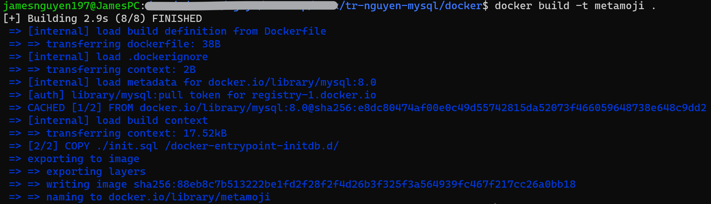
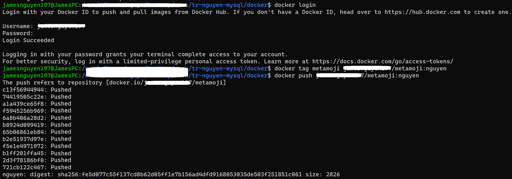
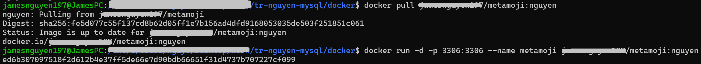
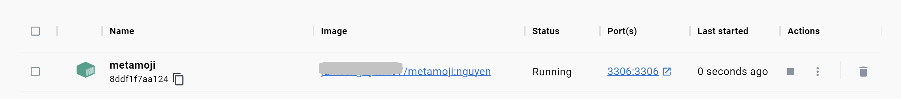
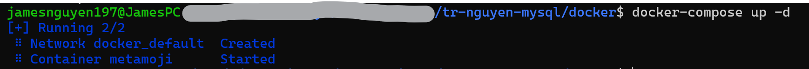
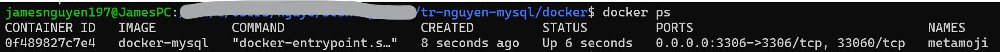

# 複数の開発チームメンバーに、共通の初期データ投入済みのMySQL コンテナを配布したい

開発チーム全員に初期データ入りのMySQL環境をDockerで配布するために、以下の手順を実行できます。

## **Dockerfileの作成:**
---
まず、MySQLのイメージを元に、カスタムDockerイメージを作成するためのDockerfileを作成します。以下の内容をDockerfileという名前で保存してください。

```
FROM mysql:8.0

# 環境変数の設定
ENV MYSQL_DATABASE=your_database_name
ENV MYSQL_USER=your_username
ENV MYSQL_PASSWORD=your_password
ENV MYSQL_ROOT_PASSWORD=your_root_password

# 初期データの追加
COPY ./init.sql /docker-entrypoint-initdb.d/
```

例えば、以下の環境変数を設定します。
```
ENV MYSQL_DATABASE=metamoji_db1
```
MySQL データベース名は metamoji_db1

```
ENV MYSQL_USER=metamoji
```
MySQL ユーザー（MySQLにアクセスユーザー）は metamoji

```
ENV MYSQL_PASSWORD=password
```
パスワード

```
ENV MYSQL_ROOT_PASSWORD=password
```

ルートパスワード

このDockerfileでは、MySQLのイメージをベースにしています。環境変数にデータベース名、ユーザ名、パスワードを設定し、初期データを追加するために ./init.sql ファイルをコンテナの /docker-entrypoint-initdb.d/ ディレクトリにコピーしています。

## **初期データを含むSQLファイルの作成:**
---
データベースの初期データを含むSQLファイルを作成します。これをinit.sqlという名前で保存してください。このファイルには、テーブルの作成やデータの挿入などが含まれます。

例: [**こちらで参考**](./init.sql)


## **Dockerイメージのビルド:**
---
Dockerfile と init.sql が同じディレクトリにあることを確認したら、次のコマンドでカスタムDockerイメージをビルドします。
```
docker build -t your_image_name .
```
例えば、
```
docker build -t metamoji .
```
<div style="text-align: center;">
</div>

## **Dockerイメージの共有:**

---
イメージがビルドされたら、それをDocker Hubなどのコンテナレジストリにプッシュして、チームメンバーと共有します。
```
docker login
docker tag your_image_name your_dockerhub_username/your_image_name:your_tag
docker push your_dockerhub_username/your_image_name:your_tag
```

具体的には、イメージ名は metamoji、ユーザー名は DockerHub のユーザー、DockerHub のイメージ名は metamoji、タグ名は自分自身で指定します。

<div style="text-align: center;">
</div>

## **チームメンバーがイメージをプルしてコンテナを実行:**
---
チームメンバーは、以下のコマンドで共有されたイメージをプルし、それを使用してコンテナを実行できます。
```
docker pull your_dockerhub_username/your_image_name:your_tag
docker run -d -p 3306:3306 --name your_container_name your_dockerhub_username/your_image_name:your_tag
```
<div style="text-align: center;">
</div>

これにより、チーム全員が初期データ入りのMySQL環境...

しかし、初期データには秘密にしたい情報があるのでDockerHubは使いたくないので、Docker Hubを使わずに秘密の情報を含むDockerイメージをチーム内で共有する方法として、以下のオプションがあります。

1. プライベートコンテナレジストリの利用:
Docker Hub以外のプライベートコンテナレジストリを利用してイメージを共有できます。例えば、Amazon Elastic Container Registry (ECR), Google Container Registry (GCR), Azure Container Registry (ACR)などがあります。これらのレジストリはアクセス制限が可能で、チーム内でのみ共有できます。

2. Dockerイメージをtarファイルとして保存して配布:
Dockerイメージをtarファイルとしてエクスポートし、チームメンバーに配布することもできます。まず、イメージをtarファイルに保存します。
```
docker save -o your_image_name.tar your_dockerhub_username/your_image_name:your_tag
```
例えば、イメージ名は metamoji で metamoji.tar を保存します。
```
docker save -o metamoji.tar <ユーザー名>/metamoji:nguyen
```
次に、tarファイルをチームメンバーに配布します。これには、チーム内のファイル共有サービス（Google DriveやDropboxなど）や、セキュアなファイル転送プロトコル（SFTPなど）を使用できます。

チームメンバーは、ダウンロードしたtarファイルを使用してDockerイメージをインポートし、それを使用してコンテナを実行できます。

```
docker load -i your_image_name.tar
docker run -d -p 3306:3306 --name your_container_name your_image_name:your_tag
```

どちらの方法でも、秘密の情報を含む初期データが外部に漏れることなく、チーム内でDockerイメージを共有できます。適切なアクセス制限とセキュリティ対策を講じてイメージを共有してください。

<div style="text-align: center;">
</div>

## **docker compose でイメージの作成**:
---
Docker Composeを使用して、初期データ入りのMySQLイメージを作成し、チーム内で共有する方法について説明します。

### **Dockerfileの作成:**
前述の手順と同様に、MySQLのイメージをベースにカスタムDockerイメージを作成するためのDockerfileを作成します。

### **初期データを含むSQLファイルの作成:**
データベースの初期データを含むSQLファイルを作成し、init.sqlという名前で保存します。

### **docker-compose.ymlファイルの作成:**
プロジェクトディレクトリに docker-compose.yml ファイルを作成し、以下の内容を記述します。
```
version: '3.8'

services:
  mysql:
    build: .
    container_name: your_container_name
    environment:
      MYSQL_DATABASE: your_database_name
      MYSQL_USER: your_username
      MYSQL_PASSWORD: your_password
      MYSQL_ROOT_PASSWORD: your_root_password
    ports:
      - "3306:3306"
    volumes:
      - ./init.sql:/docker-entrypoint-initdb.d/init.sql
```

この docker-compose.yml ファイルでは、MySQLサービスを定義し、Dockerfile をビルドしてコンテナを実行しています。環境変数やポートの設定もここで行います。

### **Dockerイメージのビルドと実行:**
Docker Composeを使用して、Dockerイメージをビルドし、コンテナを実行します。
```
docker-compose up -d
```
<div style="text-align: center;">
</div>

```docker ps``` を入力して、働いているイメージを確認できます。
<div style="text-align: center;">
</div>

### **Dockerイメージの共有:**
Dockerイメージを共有する方法として、プライベートコンテナレジストリの利用やtarファイルとして保存して配布する方法があります。前述の手順を参照してください。

### **チームメンバーがイメージをプルまたはインポートしてコンテナを実行:**
チームメンバーは、共有されたイメージをプルまたはインポートしてコンテナを実行できます。その後、彼らは自分のdocker-compose.yml ファイルを作成し、共有されたイメージを使用するようにサービスを定義できます。

Docker Composeを使用することで、複数のコンテナを含むアプリケーションを簡単に管理できます。また、 docker-compose.yml ファイルをプロジェクトのリポジトリに保存することで、チームメンバーが環境を簡単にセットアップできます。ただし、秘密情報を含む場合は、イメージを安全に共有する方法を選択してください。

## **留意:**
---
すべてイメージを作成して、tarファイルや docker-compose.ymlファイルの作成が終わりましたら、必ず```docker logout```をしてください。