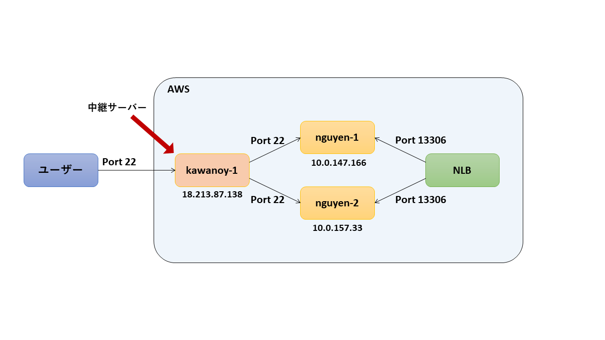
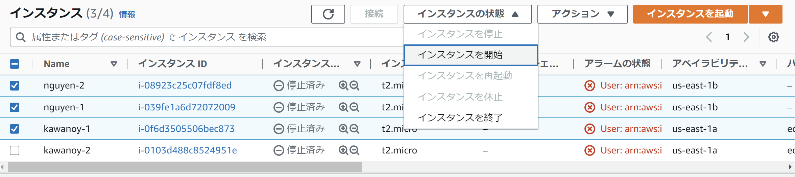
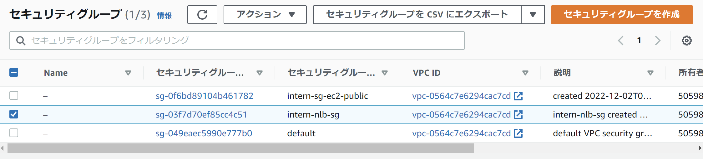
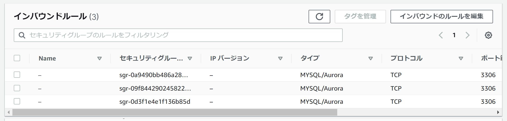
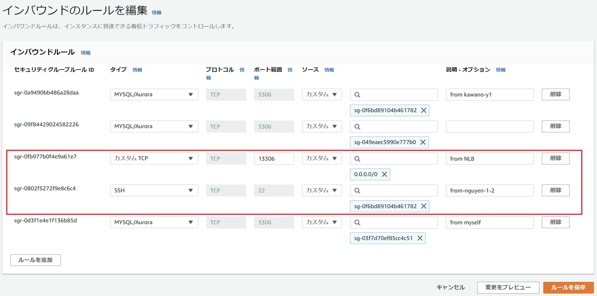
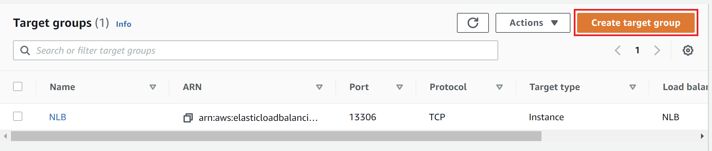
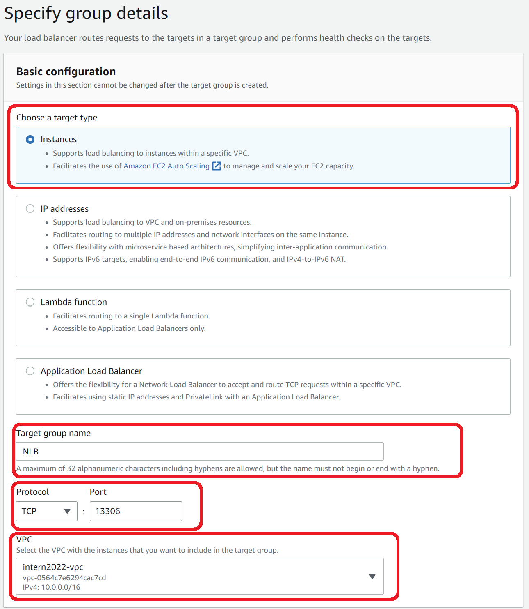
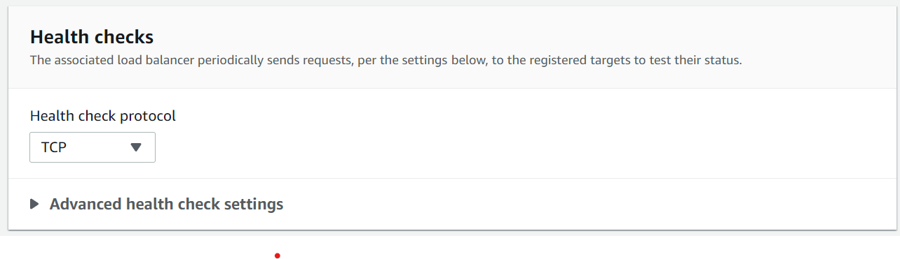
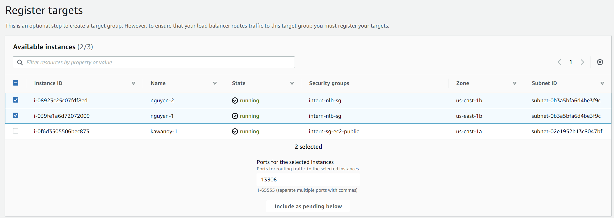
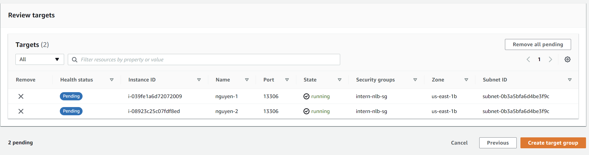

# NLB の health check の概要設計

## **概要**
NLBのHealth Checkで運用し、同期のMariaDB の database serviceを実装します。その内に1つのMariaDBがダウンすると、自動的に切り離され、他のMariaDBで実装しています。これは負荷を振り分けることで、1つのサーバの負荷を軽減する仕組みです。

## **特徴**
* NLBはレイヤ4で動作しているので、TCP、UDP、TLSのトラフィック分散
  
* WebSocketで通信を行うアプリケーションで、接続状態を長時間維持する通信処理に対応

* 送信元IPアドレスを管理でき、安定した通信処理を行え

* DSR方式の実現L4ロードバランサーのように動作可能

* 同一ポート番号での処理

## **目的:**&#x20;

* 単一の機能を1つにまとめます。

* 1台が故障や同期異常の場合、自動的に切り離され、他の台で実装しています。

## **利点:**&#x20;

* サーバーが過負荷になってダウンする状況をシステムが最小限に抑えることができます。&#x20;

* 1台が故障すると、負荷分散がそのサーバーのワークロードを残りのサーバーに振り分け、システムのアップタイムを最大限に押し上げ、全体的な性能を向上させます。

## **例:**&#x20;

例えば、以下にサーバーの接続の例があります。

ユーザーからポート22で、kawanoy-1という中継サーバーにアクセスします。中継サーバーでは、Public Networkなので、ポート22にkawanoy-1のサーバーが働いているか確認できます。また、PCからkawanoy-1にアクセスし、中継サーバーからnguyen-1とnguyen-2の2段階で接続しています。

そこで、nguyen-1またはnguyen-2が1つダウンすると、他の台で実装しています。その役割はNLBで負担します。

## **設定方法**
1. kawanoy-1とnguyen-1とnguyen-2の3つInstanceを起動します。

    

    

    この中では、IPアドレスは以下になります。

    * kawanoy-1: 18.213.87.138 (Public)
    * nguyen-1: 10.0.147.166 (Private)
    * nguyen-2: 10.0.157.33 (Private)

2. kawanoy-1 から 13306を通そうとして、SecurityGroupで SSH接続でポート22 を設定します。

    

    

    intern-nlb-sg (SecurityGroup名)を選択します。

    

    

    「インバウンドのルールを編集」をクリックします。

    

    

    インバウンドのルール編集画面でNLBからポート13306がなく、kawanoy-1からSSH接続でポート22も存在しないので、以上の図と同様に設定します。

    **※留意**: SSH:22を設定するとき、nguyen-1とnguyen-2のIPアドレスを入力するではなく、SecurityGroup名 (intern-sg-ec2-public)を入力します。

    **この段階でkawanoy-1を通してnguyen-1とnguyen-2にアクセスできます。**

3. Network Load Balancerを作成します。

    Target Groupを選択してTarget Groupを作成します。
    

    

    以下の情報で設定します。
    * Target Type: Instances
    * Target Group Name: NLB (または「Network Load Balancer」)
    * Protocol: TCP
    * Port: 13306 (ポート13306を開けます)
    * VPC: intern2022-vpc

    

    

    Health check Protocol は TCPで設定します。
    

    

    次にターゲットを登録します。今度 NLB は nguyen-1 と nguyen-2 の Instance をつなげます。nguyen-1 と nguyen-2 を選択してポート13306を設定して登録します。
    

    

    Review画面でもう一度確認してTarget Groupを登録します。
    

    

    **この段階でNLBが存在して、nguyen-1またはnguyen-2が1つダウンすると、他の台で実装しています。その役割はNLBで負担します。**

4. 検証環境で実際にNLBとEC2利用して health check 応答するかは **[こちら](https://github.com/metamoji/tr-nguyen-mysql/blob/main/%E8%A8%AD%E8%A8%88%E6%A6%82%E8%A6%81/%E6%A6%82%E8%A6%81%E8%A8%AD%E8%A8%88.md)** で実施します。